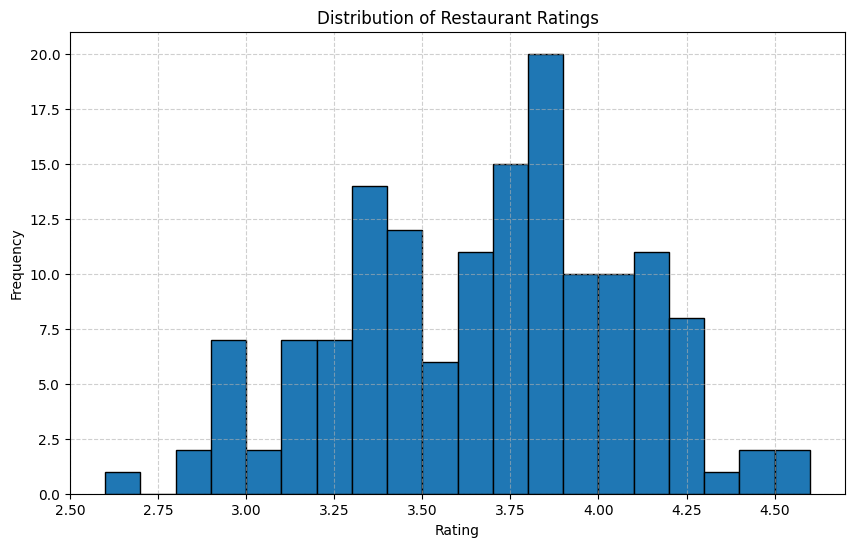
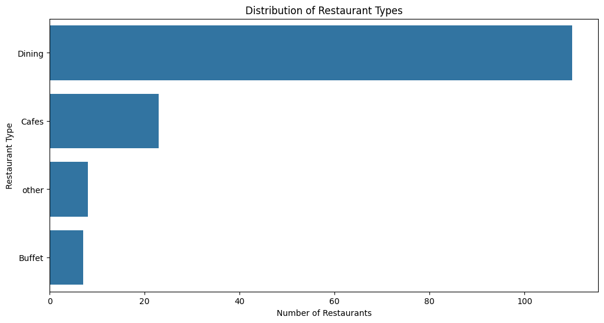
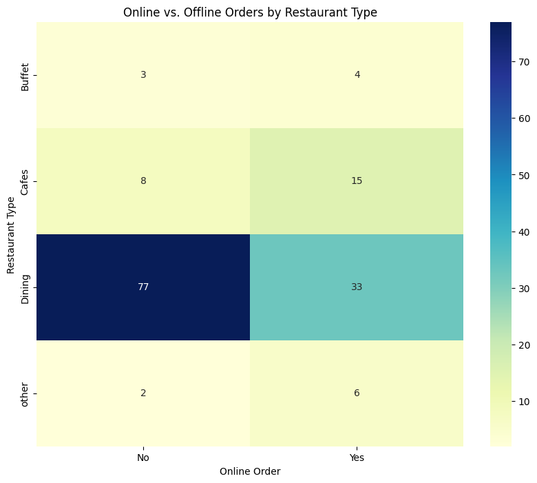
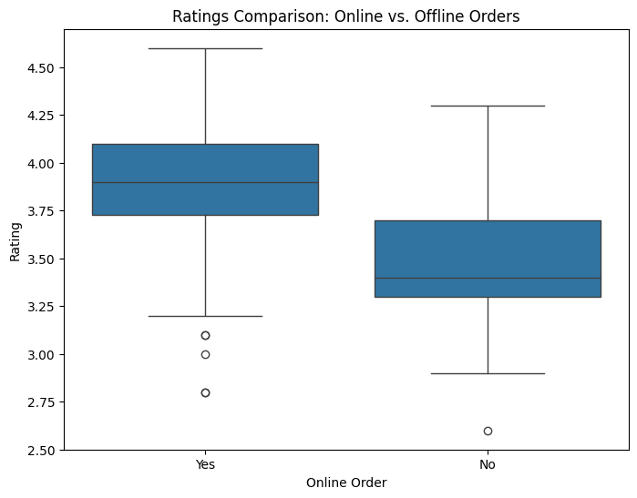
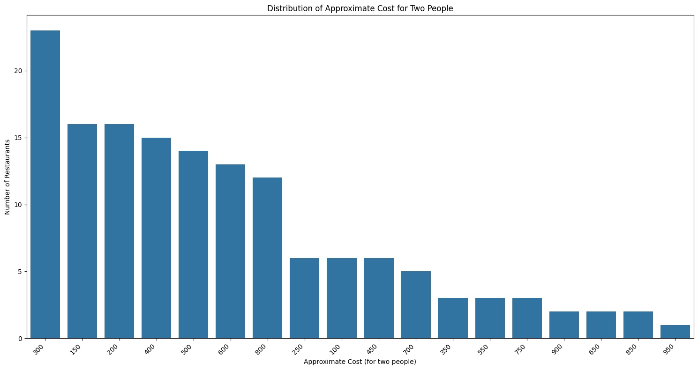
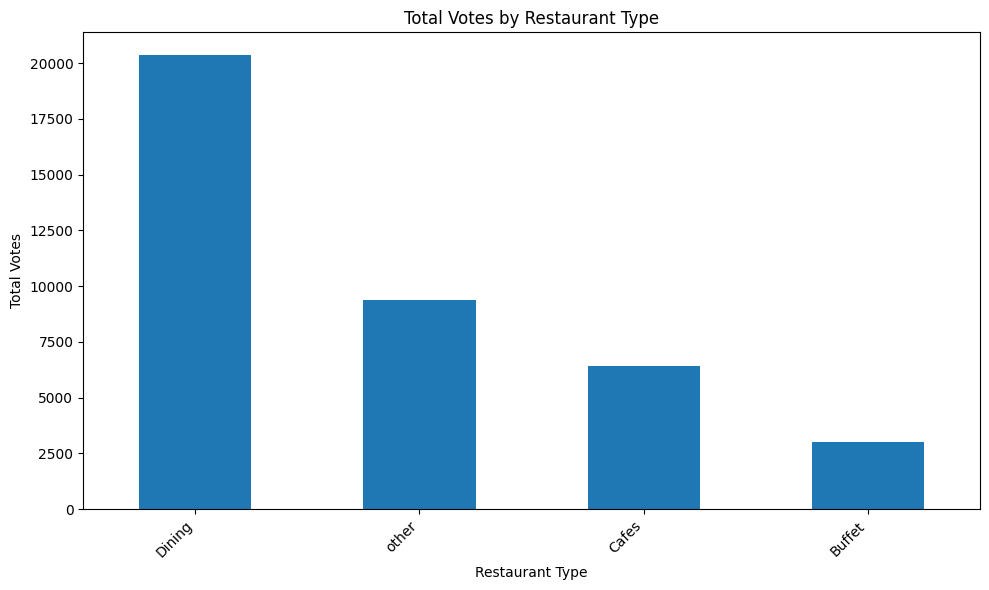

<h1 align="center">Zomato Data Analysis</h1>

<div align="center">
  
  
  
  
</div>
<br />

> **Project Task:** Data Analysis and Visualization  
> **Company:** Inlighnx Global Pvt Ltd (Internship Task)

## 📖 Overview

This data analytics project was developed as part of my internship at **Inlighnx Global Pvt Ltd**. Its primary objective is to clean, process, and analyze a real-world dataset of Zomato restaurants to uncover critical business insights and behavioral trends. 

Through exploratory data analysis (EDA), this project answers key questions regarding restaurant popularity, customer budgeting behaviors, offline vs. online ordering trends, and rating distributions.

## 📁 File Structure

The project has been organized into a professional directory structure to separate raw data, operational scripts, and generated assets:

```text
zomato-data-analysis/
├── README.md               # Project documentation
├── patch_scripts.py        # Helper script for restructuring
├── data/
│   └── Zomato data .csv    # Original Zomato dataset
├── scripts/
│   ├── datacleaning and display.py
│   ├── Find the Insights.py
│   ├── online Orders by Restaurant Type.py
│   ├── Online vs. Offline Ratings.py
│   ├── rating distibution.py
│   ├── restaurant Cost Preference for Couples.py
│   ├── type of restorant.py
│   └── vote by resto type.py
└── assets/                 # Auto-generated visual data plots
    ├── find_the_insights.png
    ├── online_orders_by_restaurant_type.png
    ├── online_vs._offline_ratings.png
    ├── rating_distibution.png
    ├── restaurant_cost_preference_for_couples.png
    ├── type_of_restorant.png
    └── vote_by_resto_type.png
```

## 📊 Data Insights & Visualizations

The scripts execute comprehensive data cleaning and generation of visualizations to illustrate key findings. Below are the core analytical highlights derived from the dataset.

### 1. Rating Distribution
The majority of Zomato-listed restaurants successfully maintain a solid rating between **3.5 and 4.0**, indicating an overall decent standard of dining quality.



### 2. Types of Restaurants
Among all available categories, **Dining** stands out as the most dominant and preferred restaurant type in the ecosystem.



### 3. Online vs Offline Orders by Restaurant Type
A distinct consumer preference pattern emerges here: customers heavily prefer online ordering for **Cafes**, whereas traditional **Dining** establishments receive primarily offline (walk-in) visits.



### 4. Ratings Comparison (Online vs Offline)
Data shows that **Online orders** tend to score noticeably higher average ratings compared to traditional offline dining experiences.



### 5. Cost Preference for Couples
The distribution of the "approximate cost for two people" highlights standard spending behavior. The most common price points reflect highly affordable to mid-tier dining options.



### 6. Total Votes by Restaurant Type
Aligning with their sheer popularity, **Dining** restaurants have garnered the highest aggregate volume of customer votes, dwarfing other categories.



---

## 🎯 Executive Summary & Key Takeaways

1. **Market Dominance:** Dining establishments command the largest share of the market, both in terms of options available and overall customer engagement/votes.
2. **Cost Expectations:** Average customer spending for online orders for a couple sits reliably around **₹510**.
3. **Quality Perception:** Customers rate their online ordering experiences slightly better than their physical visits—potentially influenced by the convenience factor.

## 🚀 Setup & Execution

To clone and re-run this analysis on your local machine:

**1. Install Dependencies**  
Ensure you have Python installed, then set up the required data science packages:
```bash
pip install pandas matplotlib seaborn
```

**2. Run the Analysis Scripts**  
Navigate to the `scripts/` directory and execute any of the Python files. The programs will automatically clean the data, generate the insights, and export the charts directly into the `assets/` folder.
```bash
cd scripts
python "Find the Insights.py"
```
